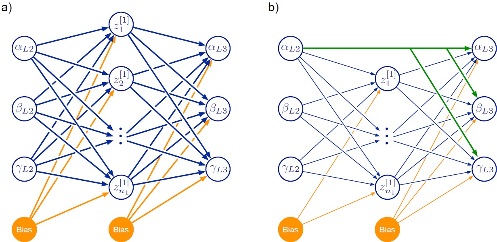

# Learning of mapping between legs in stick insects

--
### Goal 

Learning of a mapping between different legs - given as joint angles from one (target) leg and corresponding joint angles for the posterior leg (aiming at this position).

As an example, there is sample data for one single leg pairing (left middle and left hind leg). The complete data set will be made available in a data publication.

The data and trained models are explained in the publication:
Dürr, V. and Schilling, M. (submitted), Transfer of spatial contact information among limbs and the notion of peripersonal space in insects.

--
### Requirements

The neural networks are realized in the keras framework (https://keras.io) which either requires [tensorflow](https://www.tensorflow.org) or [theano](http://deeplearning.net/software/theano/).

The scripts are in python and we used python 2.7. Pickle is used to save data from training runs and matplotlib for visualizing the data.

--
### Content

The python scripts compare different neural network architectures (different size of hidden layer or introducing skip connections) evaluating the Mean Squared error.

The file structure is organized in the following way: 

* Data/ - Matlab input file containing structured data of joint angles (three joints per leg, for two legs that touch the same point in space)
  * Overlap_Targets_And_JointAngles04.mat
* Figures/ - target directory for produced figures
* Results/ - target directory for saving results from different training runs (using pickle)

--
### Training 
There are two general different architectures.

Two different models are trained:
* train_networks_mult_iterations.py - simple feedforward Neural Network without a hidden layer. Learning over multiple runs, for different architectures (varying size of hidden layer, can be specified in list hidden_size).
* train_network_skip_func_model.py - adding a hidden layer. Multiple training runs for one given size.

--
### Visualization
Visualization using Python and matplotlib.

* visualize_mp_surf_iterations.py - visualizes results from train_networks_mult_iterations.py = different architectures (training over time, MSE comparison after training)
* visualize_comparison_fwbw.py - compare forward and backward direction of mapping in a single plot.

--
### License

Copyright (c) by Biological Cybernetics Group, Bielefeld University, Bielefeld University

This work is licensed under a
Creative Commons Attribution-NonCommercial-ShareAlike 4.0 International License.

You should have received a copy of the license along with this
work. If not, see <http://creativecommons.org/licenses/by-nc-sa/4.0/>.
